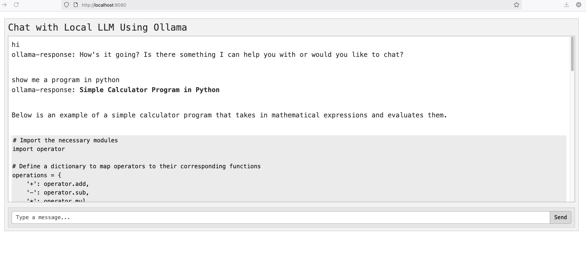

# Ollama Conversational App

A real-time conversational web app built with:

- **Spring Boot** (backend)
- **Thymeleaf + Bootstrap** (responsive UI)
- **[Ollama](https://ollama.com/)** (local LLM engine to run LLM locally like `llama3` or `mistral`)

## Demo



## Features

- 100% local and private

---

## Tech Stack

| Layer        | Technology             |
|--------------|------------------------|
| Backend      | Spring Boot   |
| Frontend     | Thymeleaf, Bootstrap 5 |
| AI Engine    | Ollama (running locally) |
| Build Tool   | Maven                  |
| Java Version | Java 21                |

---

## Prerequisites

- Java 21
- [Ollama installed](https://ollama.com)
- Maven
- A running Ollama model (`ollama run llama3`)

---

## Getting Started

1. Clone this repository

```bash
git clone https://github.com/spring-lab-01/conversation-bot-v1.git
cd conversation-bot-v1
```

2. Run Ollama model
```bash
ollama run llama3
```

3. Run the Spring Boot app
```bash
mvnw spring-boot:run

```
4. Visit the app
   Open your browser at: http://localhost:8080


